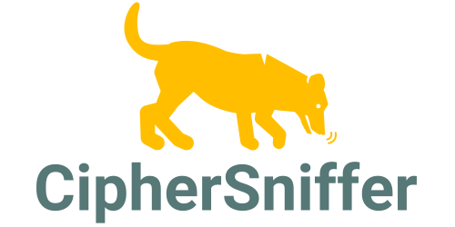
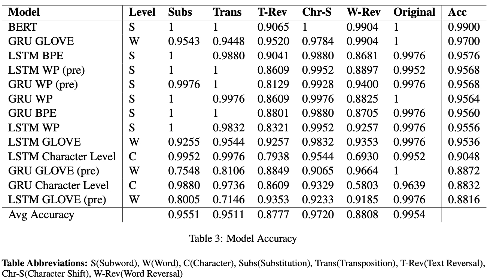

<h1 align="center">

</h1>

## CipherSniffer

This repository contains code for the CipherSniffer paper that is pending to be published.

## Abstract

Ciphers are a powerful tool for encrypting communication. There are many different cipher types, which makes it computationally expensive to solve a cipher using brute force. In this paper, we frame the decryption task as a classification problem. We first create a dataset of transpositions, substitutions, text reversals, word reversals, sentence shifts, and unencrypted text. Then, we evaluate the performance of various tokenizer-model combinations on this task.

## Results

In the following figure, we show the results table from the paper. A complete analysis of these results is in the CipherSniffer paper.

<h1 align="center">

</h1>

## Code

We provide an `examples.ipynb` file to showcase the code in this repository. This includes applying ciphers to text and training tokenizers and language models.

The environmental impact of training neural networks is something to keep in mind. We encourage anyone who wants the model weights in this paper to download them rather than train from scratch. They can all be downloaded [here](https://www.kaggle.com/datasets/brendanartley/cipherdata). If you do train the models from scratch, consider using compute resources powered by clean energy sources.

What will you find in the dataset?
- Cipherdata: Complete dataset
- Cipherdata_sample: First 100 rows from the CipherData
- Gigaword: Original and cleaned gigaword data
- GloVe: Pre-trained embedding vectors
- Models: Weights for GRUs, LSTMS, BERT
- Tokenizers: BPE, WP, and BERT tokenizer weights
